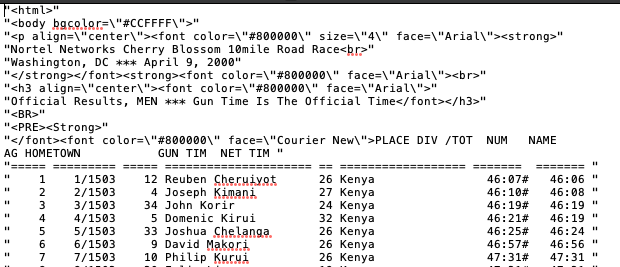

```{r setup, include=FALSE}
knitr::opts_chunk$set(echo = TRUE)
```

### Introduction
There is a lot of data available freely on the internet. For this case study, we will be practicing scraping data off of the Cherry Blossom Ten Mile Run in Washington D.C website to answer a question of our choice from the Nolan and Lang textbook. 
<br>

#### Question 17 (p.102 from textbook)
In Section 2.7, we discovered that the *HTML* file for the male 2000 results was so poorly formatted that `htmlParse()` was unable to fix it to allow us to extract the text table from the \<pre\> tag. In this exercise, we programmatically edit this *HTML* file so that we can use `htmlParse()` as desired. To do this, begin by reading the *HTML* file located at http://www.cherryblossom.org/cb003m.htm using `readLines()`. Carefully examine the *HTML* displayed in Section 2.7 and come up with a plan for correcting it. Consider whether you want to drop *\<font\>*s or close them properly. Once you have fixed the problem so that the \<pre\> tag contains the text table, pass your corrected *HTML* to `htmlParse()`. You may want to use a text connection to do this rather than writing the file to disk and reading it in. 

### Background
The Cherry Blossom Ten Mile Run is annually held in Washington D.C. in early April. The run began as a "training run for elite runners who were planning to compete in the Boston Marathon" [1] There were around 17,000 runners participating in the race as of 2012. The results of the race are published to http://www.cherryblossom.org/ every year. 

### Methods
From page 94 in the textbook, we loaded the XML library and set our base url to `http://www.cherryblossom.org/`. For question 17, we are only interested in the year 2000 male results. In order to isolate the 2000 men's results, we used `results/2000/Cb003m.htm` in the paste function.
```{r code1, echo = TRUE , include = TRUE}
#p.94


#Loading in the package
library(XML)

#This is the base url
ubase<-"http://www.cherryblossom.org/"

#This is the suffix url to get the 2000 year results
url<-paste0(ubase, "results/2000/Cb003m.htm", sep = "")

#Print the URL
print(url)

```

We attempted to use the htmlParse function to see what would happen before we modified the nodes.

```{r code2, include = TRUE, echo = TRUE}
#Let's try to use htmlParse to see what happens before we do anything

doc <- htmlParse(url)

preNode = getNodeSet(doc, "//pre")

print(preNode)
```

The print of preNode only includes the `<pre>` and `<strong>` HTML beginning and ending tags, as well as the `attr(,"class")` line, and `"XMLNodeSet"`. This does not include any of the race results.

For our next steps, we read in all of the lines from the url and attempted to write the data to a table and outputted the results to a text file. 


```{r code3, include = TRUE, echo = TRUE}

#Read in the HTML
data <- readLines(url)


#Going to take a look at the entire file on text
write.table(data, file = "table.txt", row.names =  FALSE, col.names = FALSE)
```

#### Figure 1: Screenshot of the table.txt File Generated by R


The screenshot shows the `<html>`,  `<body>`, `<p>`, `<font>`, `<strong>`, `<br>`, `<h3>` tags remaining in the file that need to be removed. We used multiple regular expressions to remove the tags in the code below.    


```{r code4, include = TRUE, echo = TRUE}

#Removing the font from where it is
data <- gsub("</font><font color=\"#800000\" face=\"Courier New\">", "", data)

#Moving font before <pre><strong> and inserting a new line
data <- gsub("<PRE><Strong>","</font><font color=\"#800000\" face=\"Courier New\">\n<PRE><Strong>", data)

```

To check our progress, we wrote the data variable to `table.htm` and used the `htmlParse()` function to generate an R structure saved as `doc2`. After reviewing the HTML file that was generated by R, we only wanted to save off the data between the `<PRE>` tag for the race results. We did this by calling the `getNodeSet()` function on `doc2`.
### Figure 1. Results of Modifying the Html File to pull from "//Pre"

```{r codeall, include = TRUE, echo = TRUE}

#write data to table.htm file
write.table(data, file = "table.htm", quote = FALSE, append=FALSE, sep="", qmethod = "double", row.names=FALSE, col.names=FALSE)

doc2 <- htmlParse("table.htm")

preNode2 = getNodeSet(doc2, "//pre")


#preNode2 still looks a little funny with &#13 at the end, but we now have the data that we didn't have before
#after looking this up, that appears to be a carriage return


```

There are 253578 characters in the variable txt. There are 3020 lines of information according to `length(els)`. From `els[1:10]`, we can see that the first 3 rows contain header information. From `els[length(els)]`, we can see that the last row contains footer information. We extracted the 3,016 male runners from the year 2000 by `elsNew <- els[5:length(els)-1]`. 

## HELP: I have a character vector elsNew with all 3016 rows of data, how the hell dow I convert this into a data frame? I've tried data.frame(elsNew.. etc) and it doesn't create 3016 rows of data
```{r els, include = TRUE, echo = TRUE}
txt = xmlValue(preNode2[[1]])
nchar(txt)
els = strsplit(txt, "\n")[[1]]
length(els)
els[1:10]
els[length(els)]
elsNew <- els[5:length(els)-1]
elsNew
```


### Results
The code above shows the process taken to rewrite the html file to pull from the "//pre" designation. By removing "font and font color" header and subbing "font and font color PRE Strong" header for "PRE Strong", allows `htmlParse()` to parse the html file with the  "//pre" header. Therefore, once `htmlParse()` is passed through `getNodeSet()` it is able to pull from "//pre" to obtain the year 2000 Cherry Blossom Ten Mile data. 

### Conclusions/Discussions

There are many ways to rewrite the html file to allow for htmlparse to have the table to be pulled easier. Some ways as suggested by the book is to find another way to properly nest the headers to allow for "//pre" to not be empty or even deleting the "/font" header entirely. Our example of re-organizing headers is one possible way to pull data from the "//pre" header. By changing the header name, it is possible to have "//pre" not be an empty set. 


### References
1. Nolan, Deborah, and Duncan Temple Lang. Data Science in R: A Case Studies Approach to Computational Reasoning and Problem Solving. Crc Press Inc., 2015.


###Results of the fix
```{r results, include = TRUE, echo = TRUE}
options(max.print=1000000000)
preNode2


```

